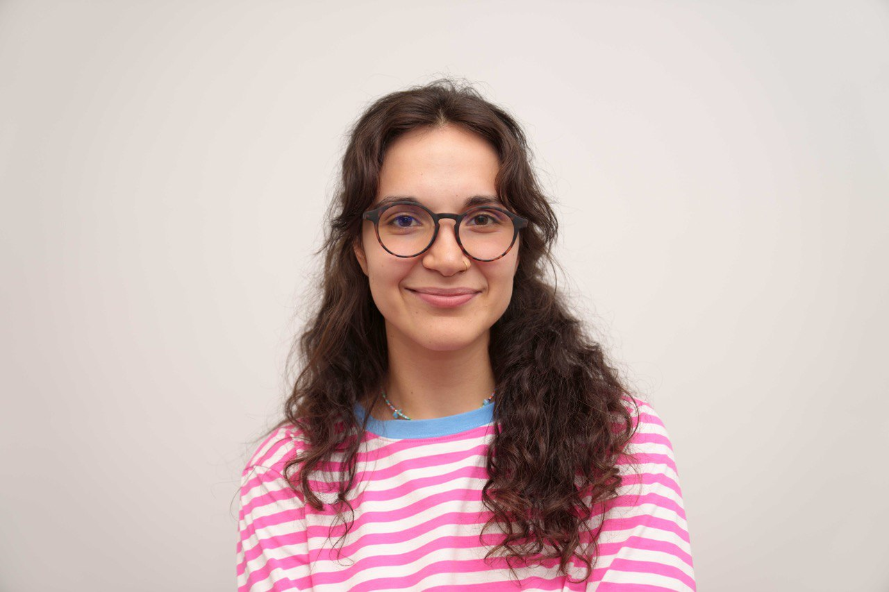

# Lisa Mangupli

** Based:** Melbourne, Victoria, Australia

<nobr> <a href="tel:+61494061291">+61 494 061 291</a></nobr>&emsp;
<nobr> lisamangupli@gmail.com</nobr>
 
<nobr> <a href="https://www.linkedin.com/in/lisa-mangupli/">Lisa Mangupli</a></nobr>&emsp;
<nobr> https://github.com/mangupli</nobr>

## About

As a full-stack software developer with a background in both corporate and startup environments, I've had the opportunity to building scalable systems and in the FinTech, design and EdTech Industries.

I am very passionate about EdTech and sharing knowledge with others. If you are looking for a dedicated and motivated team-member for your project, please don't hesitate to get in touch!

## Briefly

- 4 years full-stack experience (`Typescript`, `React`, `Node`, `Redux Toolkit`, `SQL`, `Docker`, `HTML5`, `CSS`, `PHP`)
- Was a lead front-end developer at one the largest russian banks building BI-platform
- Finalist of several large hackathons in Russia

## More

- Mentoring others in programming (and helping them fall in love with it)
- Writing code for humans, simplicity is my beauty
- Worked for a couple of governmental projects but I'm not a Russian spy

##  Experience

| Dates                         | Job                                                                                                                                                                                                                                                                                                                                                                                          |
| ----------------------------- | -------------------------------------------------------------------------------------------------------------------------------------------------------------------------------------------------------------------------------------------------------------------------------------------------------------------------------------------------------------------------------------------- |
| Mar&nbsp;2023 - Jan&nbsp;2024 | **Javascript/Typescript Fullstack Mentor at Elbrus Coding Bootcamp.** (full-time, St. Petersburg) Lectures, code-reviews, developing tools to automate training and writing assessments `React`, `Jest`,`Redux Toolkit`, `NodeJS`, `Express JS`, `PostgreSQL`, `Docker`. https://elbrusboot.camp/                                                                                            |
| Nov&nbsp;2022 - Jun&nbsp;2023 | **Lead Front-end developer in Moonk design studio.** (freelance, remote). Adapted the company's online store for mobile devices, increased accessibility, worked on a cart functionality to increase the company's online sales. `Javascript`, `PHP`, `JQuery`, `SASS`, `HTML` `Figma`. https://moonk-design.com/                                                                            |
| Aug&nbsp;2022 - May&nbsp;2023 | **Software developer in Eburet design studio** (contract, St. Petersburg). Developed web-interface for robotic arm of 3D printer. Implemented and integrated a CRM system into business processes, developed online store. `Javascript`, `React.js`, `Python`, `Tailwind`. https://eburet.com/                                                                                               |
| Sep&nbsp;2022 - Nov&nbsp;2022 | **Lead Front-end developer in Moscow Post** (contract, remote). Implemented interface for a recommendation service that tells managers in which location is best to place pick-up points. `Javascript`, `React.js`, `Webpack`, `Redux Toolkit`, `SCSS`, `Swagger API`. https://www.mos.ru/                                                                                                   |
| Jun&nbsp;2022 - Sep&nbsp;2022 | **Full-stack developer at The Ministry of Industries and Production** (contract, remote). Worked on building marketplace of Moscow manufacturers and analytics platform. Implemented SPA application and collected dataset for our recommendation model. `React.js`, `Python`, `Docker`, `Material-UI`.                                                                                      |
| Jun&nbsp;2021 - May&nbsp;2022 | **Software developer at Sovcom bank** (full-time, Kazan, hybrid). Designed and developed cross browser BI-platform. Handled integration and visualization of data in high-load data warehouse (DWH). `Javascript`, `Chart.js`, `Microsoft SQL Server`, `Docker`. https://sovcombank.ru/en/                                                                                                   |
| Aug&nbsp;2020 - Sep&nbsp;2022 | **Student at Ecole 42 computer science private school** (Kazan, Russia). Designed the architecture and implemented a command interpreter. Created simple game engine. Deployed microservices-based application. Implemented standard C++ containers. `C`, `C++`, `Kubernetes`, `Unit Testing`,`TDD`. https://42.fr/en/                                                                       |
| Sep&nbsp;2019 - Aug&nbsp;2020 | **Frontend developer at Barre One fitness studio** (full-time, St. Petersburg). Designed and developed UX/UI for the company's website and CRM system. Our team (<10 people) managed to make “Barre one” one of the most recognizable fitness companies for women in St. Petersburg in 2020. `JavaScript`, `CSS`, `HTML`, `Usability Testing`,`User Experience (UX)`. https://www.barre.one/ |

<!--
##  Мои проекты

- **Shorty** - телеграмм-бот, который создаёт краткую выжимку из сообщений в группе с помощью GPT4. `TypeScript`, `NodeJs`, `RxJS`, `Jest`, `Docker`. [Бот](https://t.me/shorty_chat_bot), [GitHub](https://github.com/mrThomasTeller/shorty-telegram-summarization-bot)

//-->

##  Education

**Diploma of Management. Russian Institute of Performing arts, St. Petersburg**
 
<em>2016&nbsp;-&nbsp;2022</em>
 
As a result of graduate thesis I designed CRM system for performing arts companies, >90% of which did not use it at the moment. 4 large theaters of St. Petersburg showed interest in such software, because it could improve their data storage and help to know their clients better.

   
  

    <a href="https://mangupli.github.io/cv/cv.pdf">PDF-version</a>
  

  

  <a href="https://mangupli.github.io/cv/">Web-version</a>
  

  PS: This is my CV but you can fork the repo and make the one for yourself. Read <a href="src/README.md">src/README.md</a>. 

