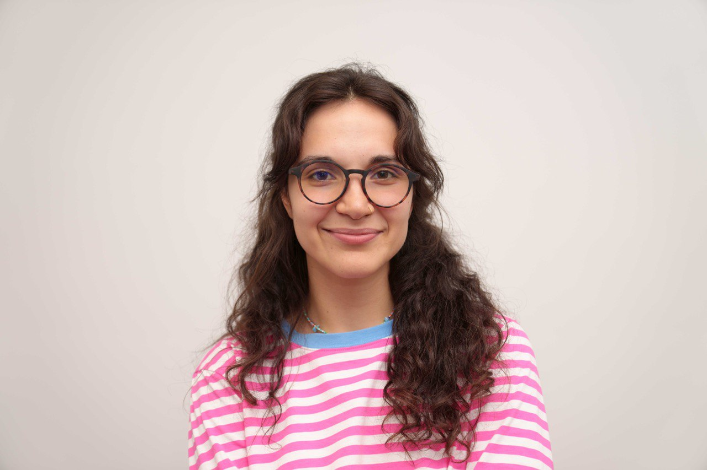

# Lisa Mangupli

** Based:** Bath, United Kingdom &nbsp;·&nbsp; Full right to work in the UK

<nobr> <a href="tel:+447830996253">+447830996253</a></nobr>&emsp;
<nobr> lisamangupli@gmail.com</nobr>
 
<nobr> <a href="https://www.linkedin.com/in/lisa-mangupli/">Lisa Mangupli</a></nobr>&emsp;
<nobr> https://github.com/mangupli</nobr>

## About

As a **software engineer** with a background in both corporate and startup environments, I've had the opportunity to building scalable systems in the FinTech and EdTech Industries.

## Briefly

- 7 years (`TypeScript`, `React`, `Elixir`, `Node`, `GraphQL`, `PostgreSQL`, `SQL`, `AWS`, `Docker`)
- Full ownership of features end-to-end
- Mentor engineers, and hackathon finalist
- Worked on a couple of government projects, but I'm not a Russian spy

##  Experience

| Dates                         | Job                                                                                                                                                                                                                                                                                                                                                                                                                                                                                                                                                                                                                                                                                                                                                                                                                                                                                                                                                                                                                      |
| ----------------------------- | ------------------------------------------------------------------------------------------------------------------------------------------------------------------------------------------------------------------------------------------------------------------------------------------------------------------------------------------------------------------------------------------------------------------------------------------------------------------------------------------------------------------------------------------------------------------------------------------------------------------------------------------------------------------------------------------------------------------------------------------------------------------------------------------------------------------------------------------------------------------------------------------------------------------------------------------------------------------------------------------------------------------------ |
| Feb&nbsp;2024 - Present       | **Cadmus** — an assessment platform used by universities in Australia, New Zealand and the UK. (<nobr>full-time</nobr>, Melbourne, then remote from the UK) <em>Lead Engineer, Nov&nbsp;2025 - Present. Senior Software Engineer, Feb&nbsp;2024 - Nov&nbsp;2025.</em><ul><li><strong>Oral assessments.</strong> Built browser video capture and playback from scratch, carrying about <strong>5,000 video responses a month</strong> from launch. Around 30% of early recordings failed. I took that to roughly <strong>99% success.</strong></li><li><strong>AI-powered assessments.</strong> Drove bringing AI into oral assessments, and built the system behind it across the Elixir pipeline and the React interface.</li><li>Also the Question Library and QTI import, multiformat assessments, and the marking and moderation user flows, along with the GraphQL migrations underneath them.</li></ul>`TypeScript`, `Elixir`, `React`, `GraphQL`, `PostgreSQL`, `AWS`, `Datadog`, `Sentry`. https://cadmus.io/ |
| Mar&nbsp;2023 - Jan&nbsp;2024 | **Fullstack Developer and Mentor at Elbrus Coding Bootcamp.** (<nobr>full-time</nobr>, St Petersburg) Taught end-to-end web development, gave the lectures, and reviewed students' code. Built the tools that automated parts of the training, and wrote the assessments students were marked on. `TypeScript`, `React`, `Redux Toolkit`, `NodeJS`, `Express`, `Jest`, `PostgreSQL`, `Docker`. https://elbrusboot.camp/                                                                                                                                                                                                                                                                                                                                                                                                                                                                                                                                                                                                  |
| Jun&nbsp;2022 - Jun&nbsp;2023 | **Contract and freelance engineer.** (remote, and St Petersburg) Four clients over a year, lead front-end on two of them.<ul><li>A recommendation tool for **Moscow Post** that tells managers where to place new pick-up points, plotted on the interactive map I built.</li><li>A marketplace and analytics platform for **the Ministry of Industries and Production**, including the dataset its recommendation model was trained on.</li><li>A web interface for the robotic arm of a 3D printer at **Eburet** design studio, plus a CRM integrated into their business processes and an online store.</li><li>Mobile layout, accessibility and cart work on the online store at **Moonk** design studio, to lift their online sales.</li></ul>`React.js`, `Python`, `Redux Toolkit`, `Docker`, `JavaScript`, `PHP`, `SASS`, `Figma`.                                                                                                                                                                                |
| Jun&nbsp;2021 - May&nbsp;2022 | **Database Developer at Sovcombank.** (<nobr>full-time</nobr>, Kazan, hybrid) Built the data layer behind the bank's BI platform, on a high-load data warehouse. Modelled the data, wrote the queries the reports run on, and handled the integration that feeds them. `SQL`, `Data modelling`, `Data engineering`, `DWH`. https://sovcombank.ru/en/                                                                                                                                                                                                                                                                                                                                                                                                                                                                                                                                                                                                                                                                     |
| Sep&nbsp;2019 - Aug&nbsp;2020 | **Earlier:** frontend developer at Barre One, a fitness studio in St Petersburg. https://www.barre.one/                                                                                                                                                                                                                                                                                                                                                                                                                                                                                                                                                                                                                                                                                                                                                                                                                                                                                                                  |

##  Education

**Computer Science. 42 Ecole – a private institution of higher education** (Kazan, Russia). <em>2020&nbsp;-&nbsp;2022</em>
 
<i>Skills:</i> `C`, `C++`, `Kubernetes`, `Unit Testing`, `TDD`, `Microservices`, `Technical Solution Design`

**Diploma of Management. Russian Institute of Performing Arts** (St Petersburg, Russia). <em>2016&nbsp;-&nbsp;2022</em>
 
My thesis designed a CRM for performing-arts companies, more than 90% of which used none at the time. Four large St Petersburg theatres wanted it, because it would improve how they stored their data and help them know their audience.

   
  

    <a href="https://mangupli.github.io/cv/cv.pdf">PDF-version</a>
  

  

  <a href="https://mangupli.github.io/cv/">Web-version</a>
  

  PS: This is my CV but you can fork the repo and make the one for yourself. Read <a href="src/README.md">src/README.md</a>. 

